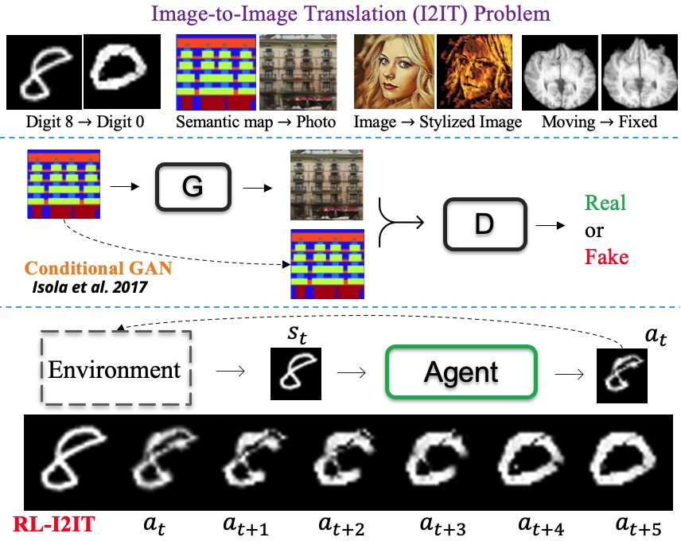

# HJAILab-OPEN
This repository contains the code implementation of the research work of Jing Hu's team in CUIT.
It includes:

* **RL-I2IT**
* \...

-----------------

## :star: RL-I2IT
[[Paper](https://arxiv.org/abs/2309.13672)]

> Most existing Image-to-Image Translation (I2IT) methods generate images in a single run of a deep learning (DL) model. However, designing such a single-step model is always challenging, requiring a huge number of parameters and easily falling into bad global minimums and overfitting. In this work, we reformulate I2IT as a step-wise decision-making problem via deep reinforcement learning (DRL) and propose a novel framework that performs RL-based I2IT (RL-I2IT). The key feature in the RL-I2IT framework is to decompose a monolithic learning process into small steps with a lightweight model to progressively transform a source image successively to a target image. Considering that it is challenging to handle high dimensional continuous state and action spaces in the conventional RL framework, we introduce meta policy with a new concept Plan to the standard Actor-Critic model, which is of a lower dimension than the original image and can facilitate the actor to generate a tractable high dimensional action. In the RL-I2IT framework, we also employ a task-specific auxiliary learning strategy to stabilize the training process and improve the performance of the corresponding task. Experiments on several I2IT tasks demonstrate the effectiveness and robustness of the proposed method when facing high-dimensional continuous action space problems. 

