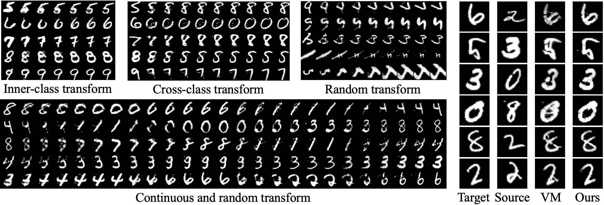

**This is the experimental code for Digits Transform.**



## Requirements

0. Version
  
  - python 3.6
  - pytorch 1.3.1
1. Install requirements:
  

```setup
pip install -r requirements.txt
```

## Get MNIST data

Run:

```setup
sh get_mnist.sh
```

## Training

0. The core algorithm is in [brain.py](brain.py), and we build environment in [env.py](env.py). The [agent.py](agent.py) handles the logic of interactions.
1. Modify [config.py](config.py) to set path to data, iterations, and other parameters.
2. To train the model(s) in the paper, run this command:

```train
python main.py
```

## Evaluation

0. Set 'idx' parameter in [config.py](config.py) to choose existing models.
1. To test our model on MNIST, run:

```test
python test.py
```

## Pre-trained Models

We recommend that you train this simple model yourself. We also provide pre-trained models, which you can download [here](https://drive.google.com/file/d/1LPdljYOSLMHuBLZJw9KjQZ2k2JVHdZ4b/view?usp=sharing).
