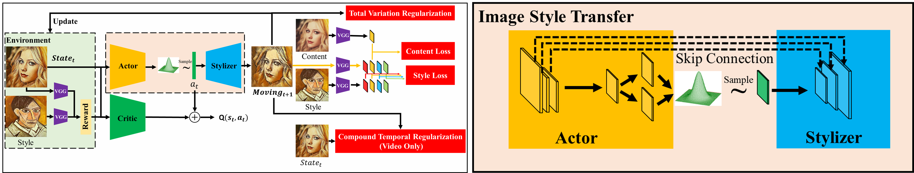

This is the experimental code for Image Style Transfer.

# RL-INST-Image

## Requirements

## How to train

1. Set the name of the style in the config.py file(NAME='style_name')
2. Set the path to the training set in the config.py file(DATASET_ROOT='your_path')
3. Set the GPU used in the config.py file(GPU_ID='gpu_id')
4. Set the path of the style image in the main.py file(style_path='style_path')
5. Run 'python main.py'

## How to eval

1. Set the path to the test set in the config.py file (TEST_DATASET_ROOT = '')
2. Set the GPU used in the config.py file(TEST_GPU_ID='gpu_id')
3. Set the model path of the encoder in the config.py file (encoder_model_path = '')
4. Set the model path of the decoder in the config.py file (decoder_model_path = '')
5. Set steps in test_only_product.py, then run test_only_product.py
6. If you just want to see the effect of one image, just run test_1_img.py

